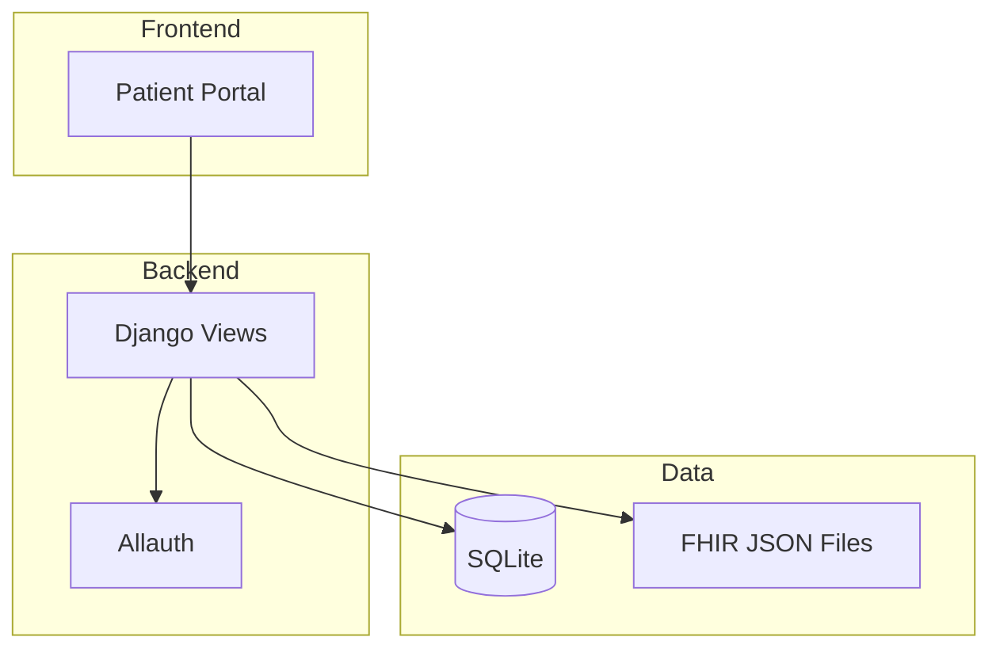

<!-- markdownlint-disable MD024 -->

**Duration:** 3 hours

**Difficulty:** Intermediate to Advanced

**Technologies:** Django, Python, Tailwind CSS, GitHub Copilot, HVE Core

**Goal:** Build a production-ready messaging portal for a healthcare application using human + AI collaboration techniques across three progressive focus areas.

## Table of Contents

- [Table of Contents](#table-of-contents)
- [Schedule and Timing](#schedule-and-timing)
- [Challenge Overview](#challenge-overview)
- [Setup](#setup)
- [Area 1: Rapid Project Exploration (45 min)](#area-1-rapid-project-exploration-45-min)
  - [Task 1.1: Codebase Walkthrough](#task-11-codebase-walkthrough)
  - [Task 1.2: Architecture Diagram](#task-12-architecture-diagram)
  - [Task 1.3: Data Model Exploration](#task-13-data-model-exploration)
- [Area 2: Development with HVE Core (90 min)](#area-2-development-with-hve-core-90-min)
  - [Task 2.1: Research Phase](#task-21-research-phase)
  - [Task 2.2: Plan Phase](#task-22-plan-phase)
  - [Task 2.3: Implement Phase](#task-23-implement-phase)
  - [Task 2.4: Quality Validation](#task-24-quality-validation)
  - [Messaging Portal Requirements](#messaging-portal-requirements)
  - [Success Criteria](#success-criteria)
- [Area 3: HVE in Engagements (45 min)](#area-3-hve-in-engagements-45-min)
  - [Task 3.1: Engagement Retrospective](#task-31-engagement-retrospective)
  - [Task 3.2: HVE Adoption Plan](#task-32-hve-adoption-plan)
  - [Task 3.3: Group Share-Out](#task-33-group-share-out)
- [Wrap-Up](#wrap-up)
  - [Reflection Questions](#reflection-questions)
- [Resources](#resources)
- [Appendix: Sample Data](#appendix-sample-data)
  - [Sample Patients](#sample-patients)
  - [Sample Messages for Testing](#sample-messages-for-testing)

## Schedule and Timing

| Start | Duration | Activity |
| ----- | -------- | -------- |
| 0:00 | 10 min | Setup and introduction |
| 0:10 | 45 min | **Area 1:** Rapid project exploration |
| 0:55 | 10 min | Break |
| 1:05 | 90 min | **Area 2:** Development with HVE Core |
| 2:35 | 10 min | Break |
| 2:45 | 45 min | **Area 3:** HVE in engagements |
| 3:30 | 10 min | Wrap-up and discussion |

## Challenge Overview

You are a developer joining the Stingray Health Portal team. The portal serves patients and healthcare providers, and your team has been asked to add secure messaging between patients and their care teams.

Over three hours you will explore the codebase, build the messaging feature using HVE Core's Research-Plan-Implement (RPI) workflow, and then brainstorm how these techniques apply to your real engagements.

| Area | Focus | What You'll Do |
| ---- | ----- | -------------- |
| Rapid Project Exploration | Understand the codebase | Navigate structure, generate architecture diagrams, map data flow end to end |
| Development with HVE Core | Build with the RPI cycle | Research requirements, plan implementation, build the messaging portal, validate AI output at scale |
| HVE in Engagements | Apply learnings | Brainstorm how HVE Core techniques translate to your current project work |

## Setup

Run the setup script to install all dependencies and initialize the Django app:

```bash
npm run setup
```

For detailed installation instructions, see [SETUP.md](SETUP.md).

Start the web front-end at [http://localhost:8000](http://localhost:8000):

```bash
npm run dev
```

Or use VS Code: `Ctrl/Cmd+Shift+P` > Run Task > Django: Run Server.

Ten test users are available with username `patient1` through `patient10` and password `password123`.

---

## Area 1: Rapid Project Exploration (45 min)

You have joined a new project and need to understand what exists before writing any code. Use GitHub Copilot to explore the codebase, map its structure, and produce documentation artifacts that demonstrate your understanding.

### Task 1.1: Codebase Walkthrough

Use GitHub Copilot to answer these questions about the Stingray Health Portal:

1. What Django apps exist and what does each one do?
2. What models are defined and how do they relate to each other?
3. How does URL routing work from the top-level `urls.py` down to app-level routes?
4. What templates exist and how does the template inheritance hierarchy work?
5. How are static assets (Tailwind CSS) built and served?
6. What authentication system is in place and how are users managed?

Write your findings in a brief summary. You can use Copilot Chat, inline completions, or agent mode to gather this context.

### Task 1.2: Architecture Diagram

Create a Mermaid architecture diagram that captures the full application structure:

1. Render the three-tier architecture: frontend (templates and static assets), backend (Django views, URLs, middleware), and data (models, database, FHIR data files)
2. Show the data flow from a user's browser request through to the database and back
3. Include the authentication flow via Django Allauth
4. Label external dependencies and the FHIR sample data integration point

Deliver the diagram as a rendered Mermaid block in a Markdown file under `docs/`.

Example structure (yours should be more detailed):



### Task 1.3: Data Model Exploration

Examine the existing models in `apps/core/models.py` and the FHIR sample data in `data/sample-bulk-fhir-datasets-10-patients/`:

1. Document the existing database schema including field types and relationships
2. Review the FHIR data files and identify what patient information is available
3. Identify the gaps between what exists and what the messaging feature will need

This task primes your understanding for Area 2 where you will design and build the messaging models.

---

## Area 2: Development with HVE Core (90 min)

Build the messaging portal using HVE Core's Research-Plan-Implement (RPI) workflow. This area focuses on using the RPI cycle to produce production-ready code, performing quality checks at scale, and validating AI-generated output before accepting it.

Codex 5.3 or Sonnet 4.6 is recommended.

### Task 2.1: Research Phase

Use the `task-researcher` agent to gather all necessary context:

1. Feed it the messaging BRD at [messaging-portal.md](docs/BRDs/messaging-portal.md)
2. Have it analyze the existing codebase structure, models, and patterns
3. Collect information about Django messaging patterns, model design, and template conventions used in the project
4. Review the research output for completeness before moving to planning

### Task 2.2: Plan Phase

Use the `task-planner` agent to create a detailed implementation plan:

1. Generate a step-by-step plan that covers models, views, URLs, templates, and admin configuration
2. Review the plan against the BRD requirements (BR-001 through BR-008)
3. Identify any gaps or incorrect assumptions in the generated plan
4. Iterate on the plan until it aligns with the requirements and existing codebase patterns

Spend time here. A thorough plan reduces rework during implementation.

### Task 2.3: Implement Phase

Use the `task-implementor` agent to build the messaging portal:

1. Execute the plan from Task 2.2
2. Monitor the implementation for deviations from the plan
3. Intervene when the agent makes choices that conflict with the BRD or existing patterns
4. Run migrations after model changes: `uv run python manage.py makemigrations && uv run python manage.py migrate`

### Task 2.4: Quality Validation

Use the `task-reviewer` agent and manual checks to validate the output:

1. Run the quality gates: `npm run lint`, `npm run typecheck`, `npm run autofix:py`
2. Review the generated code for security issues (access control, user isolation, input validation)
3. Verify the messaging feature in the browser at [http://localhost:8000](http://localhost:8000)
4. Test with multiple user accounts to confirm patient-provider isolation
5. Use Playwright or manual browser testing to validate the end-to-end workflow

### Messaging Portal Requirements

The full requirements are in [messaging-portal.md](docs/BRDs/messaging-portal.md). Key capabilities to deliver:

1. Patients can send messages to their assigned care-team members
2. Providers can view an inbox and respond to patient messages
3. Messages are grouped into threads for continuous conversation
4. Read and unread status is tracked per participant
5. Administrators can manage doctor-nurse-patient assignment relationships
6. Message ordering is consistent and chronological

### Success Criteria

- [ ] Doctor-patient relationships can be managed via the admin UI
- [ ] Patients can sign in and message their doctors or view existing message threads
- [ ] Providers can sign in and reply to messages from their assigned patients
- [ ] Message read/unread status is tracked and visible
- [ ] Messages display in consistent chronological order
- [ ] Access control prevents users from viewing messages that do not belong to them

---

## Area 3: HVE in Engagements (45 min)

Take what you learned building the messaging portal and brainstorm how to apply HVE Core techniques to your current engagement or project work.

### Task 3.1: Engagement Retrospective

Reflect on your current engagement and identify areas where HVE techniques could help:

1. Where do you spend the most time on repetitive or boilerplate tasks?
2. Which workflows involve exploring unfamiliar codebases or understanding legacy systems?
3. Where does code review or quality validation create bottlenecks?
4. What documentation artifacts (architecture diagrams, ADRs, BRDs) are missing or stale?

### Task 3.2: HVE Adoption Plan

Draft a lightweight plan for introducing HVE Core on your engagement:

1. Identify one or two workflows that would benefit most from AI-assisted development
2. Consider what `AGENTS.md` guidance your repository would need to steer agents effectively
3. Think about which MCP servers (Playwright, Serena, GitHub) would add value
4. Outline what quality gates and validation steps you would put in place
5. Consider process changes: smaller workstreams, de-emphasizing user stories in favor of epics and features, kanban boards for planning

Tooling to consider:

- HVE Core extension for RPI workflows (or build agent skills for a custom RPI workflow)
- MCP servers: Playwright, Serena, GitHub
- Pre-commit hooks with [prek](https://github.com/j178/prek) to enforce code style and quality
- A well-maintained `AGENTS.md` to guide agent behavior consistently

### Task 3.3: Group Share-Out

Share your adoption plan with the group:

1. Present one high-impact area where HVE could improve your engagement workflow
2. Describe what you would set up first and why
3. Discuss potential challenges or resistance and how you would address them

---

## Wrap-Up

### Reflection Questions

1. How did the RPI workflow compare to your usual development process?
2. Where did AI-generated output need the most human oversight?
3. What surprised you about using Copilot for codebase exploration?
4. How would you adjust the RPI cycle for your engagement's tech stack?
5. What guardrails or validation steps would you add for your team?

## Resources

- [Django Documentation](https://docs.djangoproject.com/)
- [FHIR Communication Resource](https://www.hl7.org/fhir/communication.html)
- [GitHub Copilot Documentation](https://docs.github.com/en/copilot)
- [Mermaid Diagram Syntax](https://mermaid.js.org/syntax/flowchart.html)
- [HVE Core Extension](https://marketplace.visualstudio.com/items?itemName=ise-hve-essentials.hve-core)

## Appendix: Sample Data

### Sample Patients

| Patient ID | Name | Assigned Doctor |
| ---------- | ---- | --------------- |
| P001 | John Smith | Dr. Sarah Johnson |
| P002 | Jane Doe | Dr. Michael Chen |
| P003 | Bob Wilson | Dr. Sarah Johnson |

### Sample Messages for Testing

```python
messages = [
    {
        "sender": "P001",
        "recipient": "D001",
        "content": "Question about medication",
        "timestamp": "2024-01-15 09:00:00",
    },
    {
        "sender": "D001",
        "recipient": "P001",
        "content": "What medication are you asking about?",
        "timestamp": "2024-01-15 09:15:00",
    },
    {
        "sender": "P001",
        "recipient": "D001",
        "content": "The blood pressure medication",
        "timestamp": "2024-01-15 09:20:00",
    },
]
```
