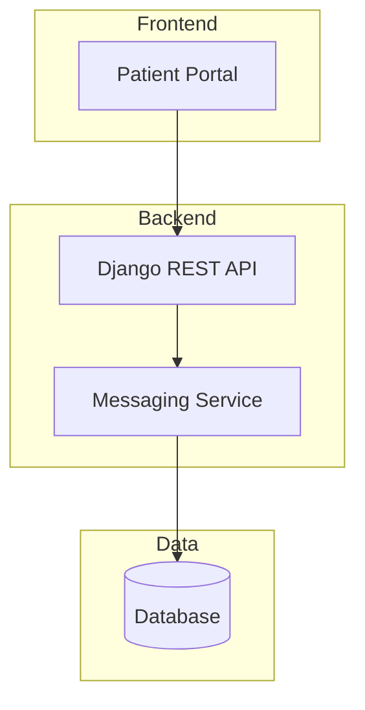

<!-- omit from toc -->
<!-- markdownlint-disable MD024 MD025 -->
# Tech Kata: Stingray Health Portal - Secure Patient Messaging

**Duration:** 2.5 hours (11:30 AM - 2:00 PM)

**Difficulty:** Intermediate to Advanced

**Technologies:** Django, Python, FHIR, GitHub Copilot

**Goal:** Provide hands-on experience with key techniques and representative scenarios of human + AI collaboration.

## Table of Contents

- [Tech Kata: Stingray Health Portal - Secure Patient Messaging](#tech-kata-stingray-health-portal---secure-patient-messaging)
  - [Table of Contents](#table-of-contents)
- [Schedule \& Timing](#schedule--timing)
- [Challenges](#challenges)
  - [Challenge Summary](#challenge-summary)
- [Setup](#setup)
  - [Prerequisites](#prerequisites)
  - [Repo setup](#repo-setup)
- [Block 1: Database Design \& Architecture (20 min)](#block-1-database-design--architecture-20-min)
  - [Task 1.1: Explore the codebase](#task-11-explore-the-codebase)
  - [Task 1.2: Database Design for Messaging](#task-12-database-design-for-messaging)
    - [Your Task](#your-task)
    - [Success Criteria](#success-criteria)
    - [Hints](#hints)
  - [Task 1.3: Architecture Diagrams](#task-13-architecture-diagrams)
    - [Your Task](#your-task-1)
    - [Deliverables](#deliverables)
  - [Task 1.4: Polling vs WebSockets ADR](#task-14-polling-vs-websockets-adr)
    - [Your Task](#your-task-2)
- [Block 2: Implement messaging (30 min)](#block-2-implement-messaging-30-min)
    - [Your Task](#your-task-3)
    - [Success Criteria](#success-criteria-1)
- [Block 3: FHIR Integration (30 min)](#block-3-fhir-integration-30-min)
    - [Success Criteria](#success-criteria-2)
    - [Hints](#hints-1)
- [Block 4: HVE on your projects](#block-4-hve-on-your-projects)
  - [Sample AGENTS.md](#sample-agentsmd)
- [Block 5: Advanced techniques](#block-5-advanced-techniques)
  - [Context window management](#context-window-management)
  - [Paste screenshots](#paste-screenshots)
  - [Playwright for workflow validation of Web UI](#playwright-for-workflow-validation-of-web-ui)
- [Wrap-up \& Discussion (10 min)](#wrap-up--discussion-10-min)
  - [Reflection Questions](#reflection-questions)
- [Advanced Topics (Optional / Take-Home)](#advanced-topics-optional--take-home)
  - [AI Feature: Message Urgency Classifier](#ai-feature-message-urgency-classifier)
  - [Beads Integration](#beads-integration)
  - [OpenCode Exploration](#opencode-exploration)
- [Resources](#resources)
- [Appendix: Sample Data](#appendix-sample-data)
  - [Sample Patients](#sample-patients)
  - [Sample Messages for Testing](#sample-messages-for-testing)

# Schedule & Timing

| Start time | Duration | Activity |
| ---- | -------- | -------- |
| 11:30 | 10 min | Setup & introduction |
| 11:40 | 20 min | **Block 1:** Database design & architecture exploration |
| 12:00 | 10 min | ☕ **Break** |
| 12:10 | 30 min | **Block 2:** Messaging portal development |
| 12:40 | 30 min | **Block 3:** FHIR integration |
| 1:10 | 10 min | ☕ **Break** |
| 1:20 | 15 min | **Block 4:** HVE on your projects |
| 1:35 | 15 min | **Block 5:** Advanced techniques |
| 1:50 | 10 min | Wrap-up & discussion |

# Challenges

This repository contains the source code for Stingray Health, a doctor-patient health portal.

Through adding functionality to the portal, you will get a chance to try different HVE techniques with the help of GitHub Copilot.

## Challenge Summary

| Technique | Scenario | What You'll Build |
| --------- | -------- | ----------------- |
| Code exploration | Architecture diagram | Architecture diagram capturing data flow between the UI → API → DB boundaries. |
| Data design | DB Design | Doctors, Patients, Messages SQL tables |
| Design documentation | ADR creation | Websockets vs polling as a data source for the web interface. |
| Research-Plan-Implement | HVE Core | Build messaging functionality into the portal |
| Dataset exploration | FHIR integration | Explore available FHIR patient data for display in the portal |
| UX validation | Playwright MCP | Validate with UX workflow acceptance criteria |

---

# Setup

## Prerequisites

- [uv](https://docs.astral.sh/uv/getting-started/installation/)
- [node.js](https://nodejs.org/en)
- WSL (if on Windows)

Quick installation:

- MacOS: `brew install node uv`
- Windows:

  ```pwsh
  wsl --install
  winget install -e --id astral-sh.uv OpenJS.NodeJS
  ```

## Repo setup

A helpful setup script is available to install all dependencies and initialize the Django app:

```sh
bash ./scripts/setup.sh
```

The webserver can be started by *`Ctrl/Cmd+Shift+P` > Run Task > Django: Run Server*, after which it will be available at [https://localhost:8000](http://localhost:8000).

There are 10 users added with username `patient1` - `patient10` and password `password123`.

---

# Block 1: Database Design & Architecture (20 min)

Currently, patients at our clinic have no direct way to communicate with their assigned doctor through the patient portal. When patients have non-urgent questions about their health, medications, or upcoming appointments, they must:

- Call the clinic and wait on hold
- Leave a voicemail and wait for a callback
- Schedule an unnecessary in-person visit
- Send emails that may go to a shared inbox and get lost

This creates friction for patients, inefficiency for clinic staff, and delays in care.

We will extend the portal to enable:

- **Patients** to send messages to their assigned doctor / nurses / admin
- **Doctors** to view and respond to messages from their patients
- **Admins** to manage doctor-nurse-patient assignments

| What Exists | What's Missing |
| ----------- | -------------- |
| Patient portal with appointments and lab results | No messaging capability |
| Patients are assigned to a primary doctor | No digital communication channel |
| Admin manages patient accounts | No way to manage doctor-patient relationships |

## Task 1.1: Explore the codebase

Use GitHub Copilot to explore the codebase and understand its inner workings before beginning.

## Task 1.2: Database Design for Messaging

We need to design a database schema to support secure messaging between patients and healthcare providers.
The full requirements are available in the [messaging-portal.md](docs/BRDs/messaging-portal.md) BRD file.

### Your Task

Using GitHub Copilot, design the database models for the messaging feature:

1. Create a `Message` model with appropriate fields
2. Consider relationships: Patient ↔ Doctor assignments
3. Design for the future (threading, read receipts, etc.)

### Success Criteria

- [ ] Message model with sender, recipient, content, timestamp
- [ ] Support for doctor-patient relationships
- [ ] Read/unread status tracking
- [ ] Proper indexes for query performance

### Hints

- Check existing models in `apps/core/models.py`
- Consider Django's `ForeignKey` relationships
- Think about message ordering and retrieval patterns

---

## Task 1.3: Architecture Diagrams

We need to document the current and proposed architecture for the messaging feature.

### Your Task

Using GitHub Copilot, create architecture diagrams:

1. **Component diagram:** Capture logical components and group them into their appropriate 3-tier architecture segments.
2. **Database design:** Entity-relationship (ER) diagram for the new database schema. Include existing schema.

### Deliverables

Create a Mermaid diagrams rendered in Markdown, for example (overly simplified):



## Task 1.4: Polling vs WebSockets ADR

The team needs to decide how messages will be delivered in real-time. Two options are being considered:

1. **Polling:** Client periodically asks server for new messages
2. **WebSockets:** Server pushes new messages to clients instantly

### Your Task

Using GitHub Copilot, write an Architecture Decision Record (ADR) following [adr-template.md](docs/ADRs/adr-template.md) that:

1. Describes the context and problem
2. Lists the options considered
3. Analyzes pros/cons of each approach
4. Documents the decision and rationale

---

# Block 2: Implement messaging (30 min)

Use the Research → Plan → Implement (RPI) agents provided by HVE Core to implement the messaging portal functionality.

Codex 5.3 or Sonnet 4.6 is recommended.

### Your Task

- Starting with the `task-researcher` agent, collect information about the new functionality to be added.
- Move on to the `task-planner` agent, building a detailed implementation plan. Review it and provide modifications as necessary to meet the BRD.
- Build the new features with `task-implementor`.
- Review the new code and apply any necessary fixes using `task-reviewer`.

### Success Criteria

Functionality described in the [messaging-portal.md](docs/BRDs/messaging-portal.md) BRD file should be available:

- [ ] doctor-patient relationships can be managed via the admin UI
- [ ] patients can sign-in and message their doctors or view existing message threads
- [ ] providers can sign-in and reply to messages from their assigned patients
- [ ] message read/unread status is tracked

---

# Block 3: FHIR Integration (30 min)

Our patient health data is currently stored in our custom-designed SQL tables which has a high maintenance burden and is not interoperable.
Recent regulations require that patients be able to obtain their own healthcare data in an interoperable format.

Our healthcare system needs to integrate with FHIR (Fast Healthcare Interoperability Resources) standard for interoperability.
Update the server to populate the *Labs Tests* and *Doctor Visits* tabs using sample FHIR dataset at `data/sample-bulk-fhir-datasets-10-patients`.

A full description of desired functionality is available in [fhir-portal-integration-brd.md](docs/BRDs/fhir-portal-integration-brd.md).

### Success Criteria

- [ ] Data source switched from SQL to FHIR JSON files from sample dataset in .env
- [ ] Only data for the current patient is rendered (there are 10 in the dataset to match the 10 logins)
- [ ] Patient's most recent recorded vitals are displayed on dashboard homepage
- [ ] Lab Tests page displays lab results and normal (reference) range for each lab
- [ ] Doctor Visits page information about the visit and vitals captured during that visit

### Hints

- Use Playwright to visually validate the results or workflows.

---

# Block 4: HVE on your projects

Process changes to consider:

- Kanban board for planning
- De-emphasize user stories; focus on epics & features
- Smaller workstreams working in parallel

Tooling to consider:

- HVE Core extension (or else, build agent skills for a RPI workflow)
- Install MCP servers: Playwright, Serena, GitHub
- Pre-commit hooks with [prek](https://github.com/j178/prek) to enforce code style and quality
- Create an `AGENTS.md` and update it regularly to nudge agents towards good behavior.

## Sample AGENTS.md

This is a sample AGENTS.md.

It considers agentic guidance to ensure desired behavior across a multitude of areas you may want to consider for your repository:

- Setup instructions after repo clone for remote unattended agents
- Reference to `bd prime` (or other tool primers) so agents can hook into those tools
- General guards against undesirable model-specific tendencies like comments and excessive backwards-compat during refactors
- Pointers to validation commands it can use and data file locations useful during debugging.
- Instructions for how to effectively interact with the app during Playwright validation
- How work should be "finished" (commit, message format, tests, push, etc).

<details>
<summary>Example AGENTS.md</summary>

~~~text
# Agent instructions

## Setup instructions

When running remotely, check `CONTRIBUTING.md` subsection *local setup* for setup instructions.

Issue numbers provided are tracked by beads, to configure:

```bash
npm install -g @beads/bd
bd init --branch beads-sync --actor agent
```

## Issue Tracking

This project uses **bd (beads)** for issue tracking.
Run `bd prime` for workflow context, or install hooks (`bd hooks install`) for auto-injection.

**Quick reference:**
- `bd ready` - Find unblocked work
- `bd create "Title" --type task --priority 2` - Create issue
- `bd close <id>` - Complete work
- `bd sync` - Sync with git (run at session end)

For full workflow details: `bd prime`

## General

- When committing changes, do not add untracked files unless you created them.
- Git hooks run tests which compiles the rust project and can take a few minutes. Do not try to circumvent this.
- Do not switch CARGO_TARGET_DIR. If the shared build directory is locked, it's because CPUs are tied up building anyways.
- Do not aim for backwards compatibility
- Do not leave comments like `// foo now handles bar` or `// foo now lives in bar`.
- When adding debug prints, always prefix them with a `// Debug` comment so we can find and remove them later.
- When using the `oraios-serena - Activate Project` tool, ensure you use the current worktree path if applicable.
- Prefer using existing libraries & patterns in the codebase over building custom solutions from scratch. Check what dependencies/utilities are already available before proposing a new implementation.
- When removing or refactoring code across the codebase, after completing changes, ensure all tests run and grep for all remaining references to the removed types/functions/modules (including in grammar files, TypeScript typeshare, tests, and UI components) before declaring the task complete.
- Use find_symbol and get_symbols_overview to understand the type hierarchy first, then only use Grep for string literals or patterns that aren't captured as symbols.

Application data files can be found:

- ~/.local/share/foo/instance-data/    (Linux)
- ~/Library/Application Support/com.bar.foo/instance-data/    (macOS)
- %APPDATA%\foo\instance-data\    (Windows)

## Web UI

- Log messages at the appropriate level using the LogLayer logger abstraction (`lib/logger.ts`), not `console.log`. Loggers should be created via `const log = getLogger(import.meta.url);`.
- When debugging, you can enable console messages for specific modules via `jsLogging.setModuleLevel('foo', 'debug')`, or several at once via `jsLogging.configure('warn,foo=debug,bar=trace')`.

## Lifecycle commands

- `npm run lint` - run biome lints
- `npm run typecheck` - run tsc to validate typescript
- `npm run typeshare` - export typeshare types from Rust to TS
- `npm run wasm-build:dev` - rebuild WASM binaries

The backend is accessible on FOO_PORT and frontend at http://localhost:{FOO_PORT+1}. `.env` defines FOO_PORT.
Only attempt to start the services yourself if a process is not already bound its port.

## Interacting with the Browser/UI

- The frontend takes 2-3s on page load to connect to the backend.
- Clicking the Search icon in the top toolbar (or Ctrl/Cmd+Shift+P) opens the Command Palette, which is the primary way of opening panels.
- The 'Properties' panel will display content relevant to the active panel.
- *Visually* validate your work. Console logs are not enough, since render bugs show code paths executing but the visualizer not updating as we'd expect.
- If you need to validate raw data received by the websocket, all nanostores are available under `window.appStores`.

## Landing the Plane (Session Completion)

**When ending a work session**, you MUST complete ALL steps below. Work is NOT complete until `git push` succeeds.

**MANDATORY WORKFLOW:**

1. **File issues for remaining work** - Create issues for anything that needs follow-up
2. **Run quality gates** (if code changed) - Tests, linters, builds
3. **Update issue status** - Close finished work, update in-progress items
4. **PUSH TO REMOTE** - This is MANDATORY:

   ```bash
   git pull --rebase
   bd sync
   git push
   git status  # MUST show "up to date with origin"
   ```

5. **Clean up** - Clear stashes, prune remote branches, close playwright browser if applicable
6. **Verify** - All changes committed AND pushed. Do not use EOF in commit commands.
7. **Hand off** - Provide context for next session

**CRITICAL RULES:**

- Work isn't done until:
  - you have validated in the UI flows with Playwright. If you need workflow instructions, ask.
  - Cargo tests pass, if you modified the Rust code.
- Commit your work when done (AFTER validating it works) using conventional commit format
  - Use conventional commit format `feat(component)`, `refactor(component)`, etc
  - Format component names using `backend:crate-name` or `webui:panel-name` for changes to engine or web UI respectively, e.g. `feat(backend:db)` or `refactor(webui:messaging)`.
  - Commit messages should have a one-line summary alongside a description of changes.
- If commit fails, resolve and retry until it succeeds

~~~

</details>

# Block 5: Advanced techniques

## Context window management

Preventing context window overflow while performing complex refactors is one of best ways to ensure higher-quality outputs.
Automatic context compaction tends to drop important details and leads to agents forgetting instructions, resulting in diverging implementation halfway through a large refactor.

RPI workflows can help alleviate this, but agentic task management tools like [beads](https://github.com/steveyegge/beads) let agents plan and breakdown work into bite-sized bits, working on each one at a time to avoid context window overflows.

It also lets you track outstanding bugfixes and polish to implement during AI collaborations without having to create heavyweight GitHub/ADO/JIRA tickets.

Think of it like an issue tracker for you and your agent's mental stack, not for epics or user stories.

## Paste screenshots

Multi-modal models are exceedingly good at parsing image data these days. When you are debugging issues, you can simply paste an image and visually describe what's wrong - "this needs to go there" or "these two things are not vertically aligned".

You can also paste browser console logs directly, which is helpful when capturing a large number of logs and/or needing to expand nested objects after a `console.log(object_with_deeply_nested_props)` (copy+pasting a console log as text only captures the object summary, so you end up missing many fields).

## Playwright for workflow validation of Web UI

When implementing complex tasks for a web UI, provide agents with a UX-based workflow validation procedure they can perform with Playwright.

This will significantly reduce the amount of validation and babysitting you need to do, and since the agent can use the combined data from the JS console, DOM, and screenshots to validate code from the end-user's experience.

---

# Wrap-up & Discussion (10 min)

## Reflection Questions

1. How did Copilot help accelerate your development process?
2. What tasks were particularly well-suited for AI assistance?
3. Where did you need to apply your own expertise?
4. What would you do differently next time?

---

# Advanced Topics (Optional / Take-Home)

If you complete the core tasks early, explore these advanced challenges:

## AI Feature: Message Urgency Classifier

Build an AI-powered feature that classifies incoming messages by urgency:

- **High:** Symptoms requiring immediate attention
- **Medium:** Follow-up questions, medication inquiries
- **Low:** Appointment scheduling, general questions

## Beads Integration

Explore using Beads for workflow orchestration in the messaging system.

## OpenCode Exploration

Use OpenCode patterns for the messaging architecture.

---

# Resources

- [Django Documentation](https://docs.djangoproject.com/)
- [FHIR Communication Resource](https://www.hl7.org/fhir/communication.html)
- [GitHub Copilot Documentation](https://docs.github.com/en/copilot)
- [Mermaid Diagram Syntax](https://mermaid.js.org/syntax/flowchart.html)

---

# Appendix: Sample Data

## Sample Patients

| Patient ID | Name | Assigned Doctor |
| ---------- | ---- | --------------- |
| P001 | John Smith | Dr. Sarah Johnson |
| P002 | Jane Doe | Dr. Michael Chen |
| P003 | Bob Wilson | Dr. Sarah Johnson |

## Sample Messages for Testing

```python
messages = [
    {"sender": "P001", "recipient": "D001", "content": "Question about medication", "timestamp": "2024-01-15 09:00:00"},
    {"sender": "D001", "recipient": "P001", "content": "What medication are you asking about?", "timestamp": "2024-01-15 09:15:00"},
    {"sender": "P001", "recipient": "D001", "content": "The blood pressure medication", "timestamp": "2024-01-15 09:20:00"},
]
```
