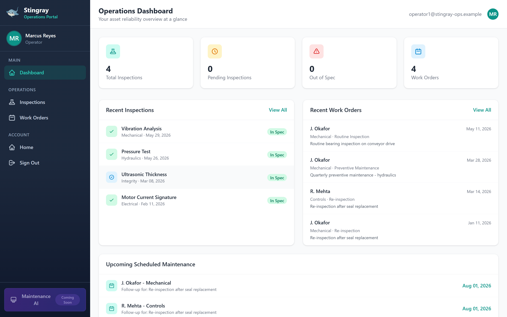
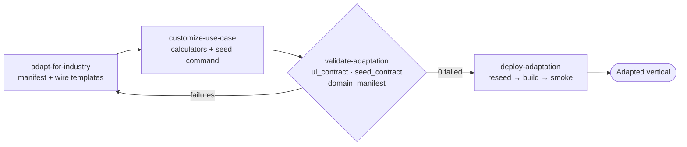

# Stingray Tech Katas — Industry Katas + Industry Adapter

A Django 5.2 + Tailwind CSS portal used for the HVE Tech Kata training program,
organized around **three pillars**:

1. **[Healthcare Kata](verticals/healthcare/)** — the baseline patient portal
   (served live on `main`).
2. **[Manufacturing Kata](verticals/manufacturing/)** — the same app re-skinned
   for plant operations, **generated** by the adapter (served live on this
   branch, `feature/industry-adapter-skills`).
3. **[Industry Adapter](industry-adapter/)** — an agent skill pack that turns the
   baseline into any vertical, and is designed to extend to N more industries.

```text
.
├── README.md                  ← you are here (three-pillar overview)
├── industry-adapter/          ← pillar 3: the engine (entry point → .github/skills)
├── verticals/                 ← pillar 1 & 2: the two industry katas (deltas)
│   ├── healthcare/            ← baseline: kata brief + reference manifest
│   └── manufacturing/         ← generated: manifest + seed + screenshot
├── .github/skills/            ← the runnable adapter skills
├── apps/, templates/, static/ ← the shared Django application
└── StingrayHealthPortal/      ← Django project settings
```

## The two katas

| Kata | Industry | Role | Records | Events | Billing | Lives on |
| --- | --- | --- | --- | --- | --- | --- |
| [Healthcare](verticals/healthcare/) | Patient portal | Patient | Lab Tests | Doctor Visits | Invoices | `main` (baseline) |
| [Manufacturing](verticals/manufacturing/) | Plant operations | Operator | Inspections | Work Orders | Purchase Orders | this branch (generated) |

Both katas run the **same** Django app. A vertical is a small delta — a
~140-line domain manifest + a synthetic seed command + an accent palette — not a
copy of the application. That is the whole point of the adapter.



## How the adapter works

Keep the **structure** stable (model fields, portal URL names, dashboard context
keys, the `visit_type` enum); swap the **skin** and the **data**. A single
`apps/core/domain.py` manifest drives all display copy, a context processor
injects `{{ domain }}` into every template, and `GET /portal/domain.json` mirrors
it. The agent runs four skills as a gated pipeline:



To adapt the portal to a **new** industry, from the repo root just ask an agent:

```console
$ copilot

▌ Apply the industry adapter to this repo for the <industry> industry.
```

Full details, the contract table, guardrails, and the extend-to-N guide are in
**[industry-adapter/README.md](industry-adapter/README.md)** and
**[.github/skills/README.md](.github/skills/README.md)**.

## Quick start (run the live app)

```bash
npm run setup     # one-time: data, deps, Tailwind build, migrate, seed
npm run dev       # http://localhost:8000
```

- **App URL**: <http://localhost:8000>
- **Admin Panel**: <http://localhost:8000/admin>
- **Debugging View** (agent-accessible browser): <http://localhost:6080>
- **Test credentials**: `patient1`–`patient20` / `password123`

See [SETUP.md](SETUP.md) for detailed installation and the
[Healthcare Kata README](verticals/healthcare/README.md) for the messaging
challenge brief.

## Tech kata challenge

This repository is set up for a 2.5-hour HVE coding kata. See
[CHALLENGES.md](CHALLENGES.md) for the full challenge description, or
[CHALLENGES-v2.md](CHALLENGES-v2.md) for the v2 challenges.

## Technology stack

- **Backend**: Django 5.2, Python 3.11
- **Frontend**: Tailwind CSS 4.1, Flowbite components
- **Database**: SQLite (development)
- **Authentication**: django-allauth
- **Standards**: FHIR (Fast Healthcare Interoperability Resources)
