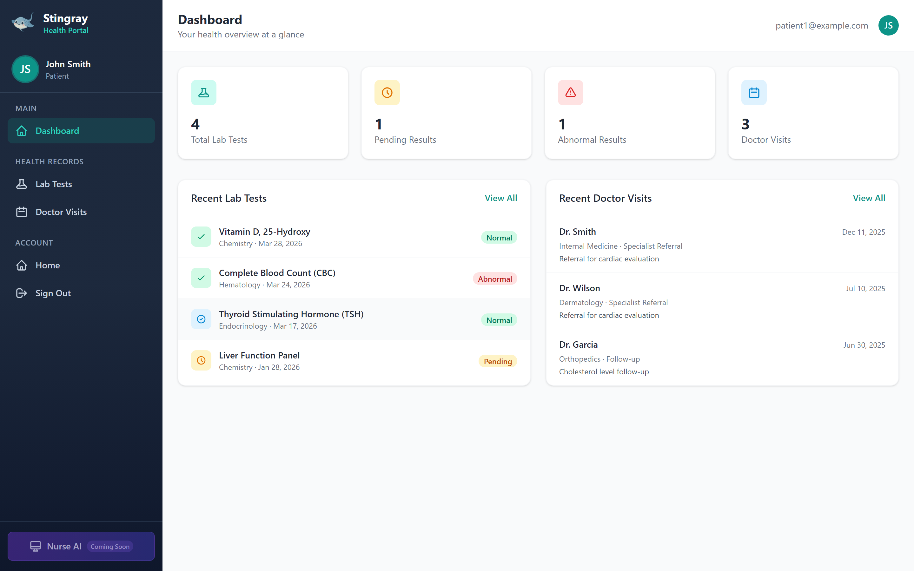

# Stingray Tech Katas — Industry Katas + Industry Adapter

A Django 5.2 + Tailwind CSS portal used for the HVE Tech Kata training program,
organized around **three pillars**:

1. **[Healthcare Kata](verticals/healthcare/)** — the baseline patient portal; a
   self-contained Django app.
2. **[Manufacturing Kata](verticals/manufacturing/)** — the same portal re-skinned
   for plant operations, **generated** from the healthcare baseline by the
   adapter; also a self-contained Django app.
3. **[Industry Adapter](industry-adapter/)** — an agent skill pack that turns the
   baseline into any vertical, and is designed to extend to N more industries.

```text
.
├── README.md                  ← three-pillar overview (you are here)
├── industry-adapter/          ← pillar 3: the engine (entry point → .github/skills)
├── .github/skills/            ← the runnable adapter skills
└── verticals/                 ← pillars 1 & 2: two self-contained kata apps
    ├── healthcare/            ← full Django app — baseline
    │   ├── apps/ templates/ static/ StingrayHealthPortal/ data/
    │   ├── docs/ (BRDs · ADRs) · SETUP.md · CHALLENGES.md · AGENTS.md
    │   └── manage.py · README.md · dashboard-healthcare.png
    └── manufacturing/         ← full Django app — generated adaptation
        ├── apps/ … (incl. apps/core/domain.py manifest + seed_manufacturing)
        └── manage.py · README.md · SETUP.md · AGENTS.md · dashboard-manufacturing.png
```

## The two katas

| Kata | Industry | Role | Records | Events | Billing | Location |
| --- | --- | --- | --- | --- | --- | --- |
| [Healthcare](verticals/healthcare/) | Patient portal | Patient | Lab Tests | Doctor Visits | Invoices | `verticals/healthcare/` |
| [Manufacturing](verticals/manufacturing/) | Plant operations | Operator | Inspections | Work Orders | Purchase Orders | `verticals/manufacturing/` |

Each kata is a **self-contained Django app** under `verticals/` — duplicated on
purpose so it runs independently. Manufacturing was *generated* from the
healthcare baseline by the adapter: the structure (model fields, portal URL
names, dashboard context keys, the `visit_type` enum) is identical; only the
display copy, the `apps/core/domain.py` manifest, and the seed data differ.

The two katas play different roles. **Healthcare is the training kata** — it
carries the coding-challenge briefs (`CHALLENGES.md`, `CHALLENGES-v2.md`) and
design docs (`docs/` — BRDs · ADRs). **Manufacturing is a generated showcase**
that demonstrates the adapter's output end-to-end and intentionally omits the
challenge material; it is not a second exercise.

The same dashboard, two skins — baseline on the left, generated adaptation on the right:

<table>
<tr>
<td width="50%" align="center"><strong>Healthcare (baseline)</strong><br/><em>Patient portal</em><br/><br/></td>
<td width="50%" align="center"><strong>Manufacturing (generated)</strong><br/><em>Operations portal</em><br/><br/></td>
</tr>
</table>

## How the adapter works

Keep the **structure** stable (model fields, portal URL names, dashboard context
keys, the `visit_type` enum); swap the **skin** and the **data**. A single
`apps/core/domain.py` manifest drives all display copy, a context processor
injects `{{ domain }}` into every template, and `GET /portal/domain.json` mirrors
it. The agent runs four skills as a gated pipeline:


To adapt the portal to a **new** industry, from the repo root just ask an agent:

```console
$ copilot

▌ Apply the industry adapter to this repo for the <industry> industry.
```

Full details, the contract table, guardrails, and the extend-to-N guide are in
**[industry-adapter/README.md](industry-adapter/README.md)** and
**[.github/skills/README.md](.github/skills/README.md)**.

## Quick start (run a kata)

Each kata is self-contained — pick one and run it from its own folder:

```bash
cd verticals/healthcare      # or: cd verticals/manufacturing
npm run setup     # one-time: data, deps, Tailwind build, migrate, seed
npm run dev       # http://localhost:8000
```

- **App URL**: <http://localhost:8000>
- **Admin Panel**: <http://localhost:8000/admin>
- **Debugging View** (agent-accessible browser): <http://localhost:6080>
- **Test credentials**: healthcare `patient1`–`patient20`, manufacturing `operator1`… (all `password123`)

See each kata's `SETUP.md` for detailed installation
([healthcare](verticals/healthcare/SETUP.md) ·
[manufacturing](verticals/manufacturing/SETUP.md)) and the
[Healthcare Kata README](verticals/healthcare/README.md) for the messaging
challenge brief.

## Tech kata challenge

The healthcare kata is set up for a 2.5-hour HVE coding kata. See
[CHALLENGES.md](verticals/healthcare/CHALLENGES.md) for the full challenge
description, or [CHALLENGES-v2.md](verticals/healthcare/CHALLENGES-v2.md) for the
v2 challenges.

## Technology stack

- **Backend**: Django 5.2, Python 3.11
- **Frontend**: Tailwind CSS 4.1, Flowbite components
- **Database**: SQLite (development)
- **Authentication**: django-allauth
- **Standards**: FHIR (Fast Healthcare Interoperability Resources) — healthcare
  baseline only; each generated vertical carries its own compliance context via
  the domain manifest
