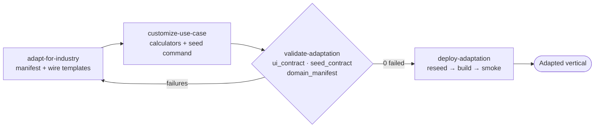

# Industry Adapter

> The third pillar of this repository. The two katas in
> [`../verticals/`](../verticals/) are what the adapter **starts from**
> (healthcare) and **produces** (manufacturing). This folder is the entry point
> to the engine; the runnable skills live at
> [`../.github/skills/`](../.github/skills/).

The adapter is an **agent skill pack** that adapts the Stingray portal from one
industry to another by **generating** the vertical instead of hand-editing it.
The skills are the product — the committed baseline always stays healthcare, and
verticals are produced on demand.

## The idea

Keep the **structure** stable; swap the **skin** and the **data**.

| Layer | Stays stable (contract) | Adapted per vertical |
| --- | --- | --- |
| Models (`apps/core/models.py`) | model + field names | row VALUES |
| Views (`apps/core/views.py`) | dashboard context keys, `visit_type` codes | — |
| URLs (`apps/core/urls.py`) | URL names + paths | — |
| Templates (`templates/`) | `` targets, data bindings | brand, labels, copy |

A single **domain manifest** (`apps/core/domain.py`) is the source of truth for
all vertical display copy. A context processor injects `{{ domain }}` into every
template, and `GET /portal/domain.json` mirrors it — so a re-skin can never
silently break a data binding, and the `ui_contract` validator proves it.

## The four skills (run in order)

| Skill | Purpose |
| --- | --- |
| [`adapt-for-industry`](../.github/skills/adapt-for-industry/SKILL.md) | Generate the domain manifest (brand, role, entity terms, nav, theme, compliance) and wire templates to it |
| [`customize-use-case`](../.github/skills/customize-use-case/SKILL.md) | Generate vertical calculators + an entity-mapped synthetic `seed_<slug>` command |
| [`validate-adaptation`](../.github/skills/validate-adaptation/SKILL.md) | Read-only, architecture-aware validator; `ui_contract` catches label↔binding drift (safe on the baseline) |
| [`deploy-adaptation`](../.github/skills/deploy-adaptation/SKILL.md) | Classify → validate → migrate (only if needed) → reseed → build → smoke/Playwright (owns all mutating steps) |

## Extend to a new industry (N verticals)

The two katas here (healthcare, manufacturing) are illustrative — the adapter is
designed to extend to any vertical (finance, legal, education, energy, …):

1. From the repo root, ask an agent: *"Apply the industry adapter to this repo
   for the **&lt;industry&gt;** industry."*
2. The agent runs the pipeline above and produces a new `domain.py` + `seed_<slug>`
   that map onto the same six models, dashboard context keys, URL names, and
   `visit_type` codes.
3. To preserve it as a showcase kata, drop its `domain.py`, `seed_<slug>.py`, and
   a screenshot into a new `verticals/<industry>/` folder following the pattern
   in [`../verticals/manufacturing/`](../verticals/manufacturing/), and add a row
   to the repository README's kata table.

## Guardrails the skills enforce

- **Sibling, not overwrite** — generate into new files; the only edits to existing
  files are mechanical `{{ domain.* }}` swaps and one settings line.
- **Stable keys, swapped values** — keep model fields, context keys, URL names,
  and `visit_type` codes stable.
- **Synthetic data only** — every vertical carries a compliance note.
- **Generation is separate from mutation** — only `deploy-adaptation` migrates,
  reseeds, builds, or runs the app.

See [`../.github/skills/README.md`](../.github/skills/README.md) for the full
entity-mapping anchor, the stable-key contract, and ready-to-adapt presets.
