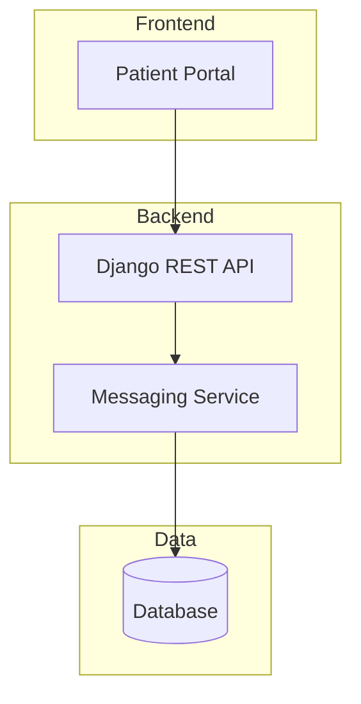

# Tech Kata: Stingray Health Portal - Secure Patient Messaging

**Duration:** 2.5 hours (11:30 AM - 2:00 PM)  
**Difficulty:** Intermediate to Advanced  
**Technologies:** Django, Python, FHIR, GitHub Copilot

---

## Schedule & Timing

| Time | Duration | Activity |
|------|----------|----------|
| 11:30 - 11:40 | 10 min | Setup & Introduction |
| 11:40 - 12:15 | 35 min | **Block 1:** Database Design & Architecture |
| 12:15 - 12:25 | 10 min | ☕ **Break** |
| 12:25 - 1:00 | 35 min | **Block 2:** ADR & Code Exploration |
| 1:00 - 1:15 | 15 min | 🍕 **Lunch Break** |
| 1:15 - 1:50 | 35 min | **Block 3:** Bug Fix & FHIR Integration |
| 1:50 - 2:00 | 10 min | Wrap-up & Discussion |

---

## The Problem

Currently, patients at our clinic have no direct way to communicate with their assigned doctor through the patient portal. When patients have non-urgent questions about their health, medications, or upcoming appointments, they must:

- Call the clinic and wait on hold
- Leave a voicemail and wait for a callback
- Schedule an unnecessary in-person visit
- Send emails that may go to a shared inbox and get lost

**This creates friction for patients, inefficiency for clinic staff, and delays in care.**

---

## Current State vs. Desired Future State

| What Exists | What's Missing |
|-------------|----------------|
| Patient portal with appointments and lab results | No messaging capability |
| Patients are assigned to a primary doctor | No digital communication channel |
| Admin manages patient accounts | No way to manage doctor-patient relationships |

### Desired Future State

Build a secure messaging feature within the patient portal that enables:

- **Patients** to send messages to their assigned doctor / nurses / admin
- **Doctors** to view and respond to messages from their patients
- **Admins** to manage doctor-nurse-patient assignments

---

## Outcome

Provide a baseline of HVE readiness to the studio by capturing key techniques and representative scenarios of human + AI collaboration.

---

## HVE Techniques Mapping

| Technique | What You'll Build |
|-----------|-------------------|
| DB Design | Doctors, Patients, Messages tables |
| Architecture Diagram | Simple 3-tier (UI → API → DB) |
| ADR | "Why we chose polling vs WebSockets for real-time" |
| Copilot Code Explain | Walk through message retrieval logic |
| Bug Fix | "Messages showing in wrong order" |
| FHIR Integration | Map messages to FHIR Communication resource |
| AI Feature (optional) | Message urgency classifier |

---

## Setup

```bash
npm install
pip install -r requirements.txt
python manage.py migrate
chmod +x ./start.sh
./start.sh
```

---

# Block 1: Database Design & Architecture (35 min)

## TICKET-001: Database Design for Messaging

**Time:** 15 minutes

### Context

We need to design a database schema to support secure messaging between patients and healthcare providers. The design should support:

- Messages between patients and their assigned doctors/nurses
- Message threads for conversation grouping
- Read/unread status tracking
- Message attachments (future consideration)

### Your Task

Using GitHub Copilot, design the database models for the messaging feature:

1. Create a `Message` model with appropriate fields
2. Consider relationships: Patient ↔ Doctor assignments
3. Design for scalability (threading, read receipts, etc.)

### Success Criteria

- [ ] Message model with sender, recipient, content, timestamp
- [ ] Support for doctor-patient relationships
- [ ] Read/unread status tracking
- [ ] Proper indexes for query performance

### Hints

- Check existing models in `apps/core/models.py`
- Consider Django's `ForeignKey` relationships
- Think about message ordering and retrieval patterns

---

## TICKET-002: Architecture Diagram

**Time:** 20 minutes

### Context

Before implementing, we need to document the current and proposed architecture for the messaging feature.

### Your Task

Using GitHub Copilot, create architecture diagrams:

1. **Current State:** Document the existing 3-tier architecture
2. **Future State:** Add messaging components to the architecture

### Deliverables

Create a Mermaid diagram showing:
- Frontend (Patient Portal UI)
- Backend (Django API)
- Database (SQLite/PostgreSQL)
- New messaging service components

### Example Structure



---

# ☕ Break (10 min) - 12:15 to 12:25

---

# Block 2: ADR & Code Exploration (35 min)

## TICKET-003: Write an ADR - Polling vs WebSockets

**Time:** 20 minutes

### Context

The team needs to decide how messages will be delivered in real-time. Two options are being considered:

1. **Polling:** Client periodically asks server for new messages
2. **WebSockets:** Server pushes new messages to clients instantly

### Your Task

Using GitHub Copilot, write an Architecture Decision Record (ADR) that:

1. Describes the context and problem
2. Lists the options considered
3. Analyzes pros/cons of each approach
4. Documents the decision and rationale

### ADR Template

```markdown
# ADR-001: Real-time Message Delivery Mechanism

## Status
[Proposed | Accepted | Deprecated | Superseded]

## Context
[Describe the problem and why a decision is needed]

## Decision Drivers
- [List key factors influencing the decision]

## Options Considered
1. Short Polling
2. Long Polling
3. WebSockets
4. Server-Sent Events (SSE)

## Decision
[State the decision]

## Consequences
### Positive
- [List benefits]

### Negative
- [List drawbacks]

## References
- [Links to relevant documentation]
```

---

## TICKET-004: Explain Code Using Copilot

**Time:** 15 minutes

### Context

A new team member needs to understand how message retrieval will work. Use Copilot to generate and explain the message retrieval logic.

### Your Task

1. Write a view function that retrieves messages for a patient
2. Use Copilot Chat to explain the code
3. Document the explanation in comments

### Example Code to Explore

```python
def get_patient_messages(request, patient_id):
    """
    Retrieve all messages for a specific patient.
    Use Copilot to explain:
    - Query optimization
    - Pagination strategy
    - Security considerations
    """
    # Ask Copilot: "Explain what this code does and how it handles security"
    pass
```

### Success Criteria

- [ ] Working message retrieval function
- [ ] Clear code comments explaining the logic
- [ ] Understanding of query optimization opportunities

---

# 🍕 Lunch Break (15 min) - 1:00 to 1:15

---

# Block 3: Bug Fix & FHIR Integration (35 min)

## TICKET-005: Fix Bug - Messages Showing in Wrong Order

**Time:** 15 minutes

### Bug Report

**Title:** Messages displaying in wrong chronological order

**Description:** Users report that messages in their inbox appear out of order. Newer messages sometimes appear below older messages.

**Steps to Reproduce:**
1. Open patient messaging inbox
2. View conversation thread
3. Notice messages are not in chronological order

**Expected:** Messages should display newest first (or oldest first consistently)

**Actual:** Messages appear in random/inconsistent order

### Your Task

1. Use Copilot to diagnose the root cause
2. Identify the sorting issue in the query or view
3. Fix the bug and verify the fix

### Hints

- Check the `order_by` clause in message queries
- Verify timestamp fields are being used correctly
- Consider timezone handling issues

---

## TICKET-006: FHIR Integration - Map Messages to Communication Resource

**Time:** 20 minutes

### Context

Our healthcare system needs to integrate with FHIR (Fast Healthcare Interoperability Resources) standards. Messages should be mapped to the FHIR Communication resource format.

### FHIR Communication Resource Structure

```json
{
  "resourceType": "Communication",
  "id": "example",
  "status": "completed",
  "category": [{
    "coding": [{
      "system": "http://terminology.hl7.org/CodeSystem/communication-category",
      "code": "notification"
    }]
  }],
  "subject": {
    "reference": "Patient/123"
  },
  "sender": {
    "reference": "Practitioner/456"
  },
  "recipient": [{
    "reference": "Patient/123"
  }],
  "payload": [{
    "contentString": "Message content here"
  }],
  "sent": "2024-01-15T10:30:00Z"
}
```

### Your Task

1. Create a function to convert Django Message model to FHIR Communication format
2. Create a function to parse FHIR Communication into Django Message
3. Test the bidirectional mapping

### Success Criteria

- [ ] `message_to_fhir()` function converts Django model to FHIR JSON
- [ ] `fhir_to_message()` function parses FHIR JSON to Django model
- [ ] Round-trip conversion preserves data integrity

---

# Wrap-up & Discussion (10 min) - 1:50 to 2:00

## Reflection Questions

1. How did Copilot help accelerate your development process?
2. What tasks were particularly well-suited for AI assistance?
3. Where did you need to apply your own expertise?
4. What would you do differently next time?

---

# Advanced Topics (Optional / Take-Home)

If you complete the core tasks early, explore these advanced challenges:

## AI Feature: Message Urgency Classifier

Build an AI-powered feature that classifies incoming messages by urgency:

- **High:** Symptoms requiring immediate attention
- **Medium:** Follow-up questions, medication inquiries
- **Low:** Appointment scheduling, general questions

## Beads Integration

Explore using Beads for workflow orchestration in the messaging system.

## OpenCode Exploration

Use OpenCode patterns for the messaging architecture.

---

# Resources

- [Django Documentation](https://docs.djangoproject.com/)
- [FHIR Communication Resource](https://www.hl7.org/fhir/communication.html)
- [GitHub Copilot Documentation](https://docs.github.com/en/copilot)
- [Mermaid Diagram Syntax](https://mermaid.js.org/syntax/flowchart.html)

---

# Appendix: Sample Data

## Sample Patients

| Patient ID | Name | Assigned Doctor |
|------------|------|-----------------|
| P001 | John Smith | Dr. Sarah Johnson |
| P002 | Jane Doe | Dr. Michael Chen |
| P003 | Bob Wilson | Dr. Sarah Johnson |

## Sample Messages for Testing

```python
# Use these for testing message ordering bug
messages = [
    {"sender": "P001", "recipient": "D001", "content": "Question about medication", "timestamp": "2024-01-15 09:00:00"},
    {"sender": "D001", "recipient": "P001", "content": "What medication are you asking about?", "timestamp": "2024-01-15 09:15:00"},
    {"sender": "P001", "recipient": "D001", "content": "The blood pressure medication", "timestamp": "2024-01-15 09:20:00"},
]
```
