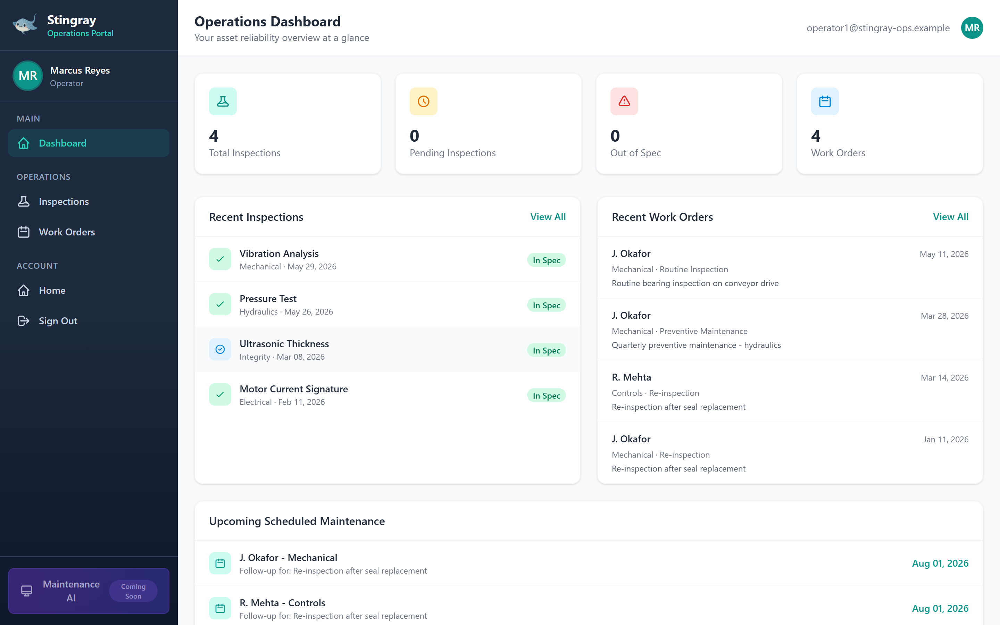

# Manufacturing Kata — Stingray Operations Portal

> One of two industry katas in this repository. This vertical was **generated**
> from the [healthcare baseline](../healthcare/) by the
> [Industry Adapter](../../industry-adapter/) — not hand-built. See the
> [repository README](../../README.md) for the three-pillar overview.

The same Django application, re-skinned for **plant operations**: operators
instead of patients, equipment inspections instead of lab tests, work orders
instead of doctor visits, and purchase orders instead of medical bills. The
structure (model fields, dashboard context keys, portal URL names, `visit_type`
codes) is **identical** to healthcare — only the display copy and seed data
change.



## What this kata is

This branch (`feature/industry-adapter-skills`) serves the manufacturing vertical
live, proving the adapter end-to-end. It is the output of running the four
adapter skills in order against the healthcare baseline.

## The delta (what makes it "manufacturing")

A vertical is a small, well-contained delta on top of the shared app:

| File | Role |
| --- | --- |
| [`domain.py`](domain.py) | Domain manifest — all display copy: brand, role, entity terms, nav, page meta, `visit_type` labels, home page, compliance, **accent theme**. |
| [`seed_manufacturing.py`](seed_manufacturing.py) | Entity-mapped synthetic seed: operators, inspection readings, work orders, purchase orders mapped onto the existing six models. |
| `dashboard-manufacturing.png` | Screenshot of the rendered result. |

The accent palette lives in the manifest's `theme.accent` block and is applied
at runtime — no separate CSS file. Shared adapter wiring (`context_processors.py`,
`templatetags/`, `templates/partials/`) is identical for every vertical.

## Entity mapping

| Model | Healthcare meaning | Manufacturing role |
| --- | --- | --- |
| `User` / `PatientProfile` | Patient | Operator |
| `LabTest` | Lab result | Equipment inspection reading (In Spec / Out of Spec) |
| `DoctorVisit` | Appointment | Maintenance work order |
| `Invoice` / `InvoiceLineItem` | Medical bill | Purchase order |

## How it was produced / how to reproduce

Don't hand-edit — ask an agent to run the adapter pipeline (see
[`../../industry-adapter/`](../../industry-adapter/)):

```text
adapt-for-industry  →  customize-use-case  →  validate-adaptation  →  deploy-adaptation
   manifest + wiring      seed command           ui_contract gate        reseed → build → smoke
```

To apply this exact vertical onto a fresh baseline manually, the adapter copies
`domain.py` into `apps/core/` and `seed_manufacturing.py` into
`apps/core/management/commands/`, then reseeds and rebuilds — every mutating step
is owned by `deploy-adaptation`.

## Compliance note

Synthetic demonstration data only. Quality and safety records modeled on
ISO 9001 / OSHA / ISO 55000 asset-management practices; not a system of record.
